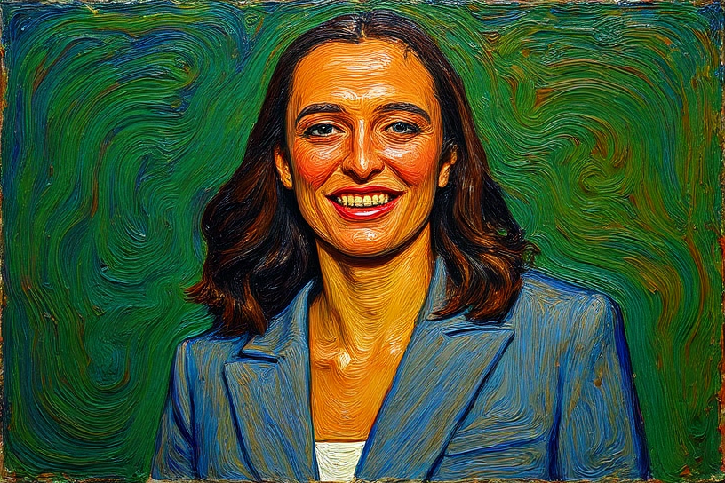
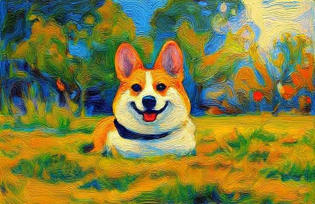
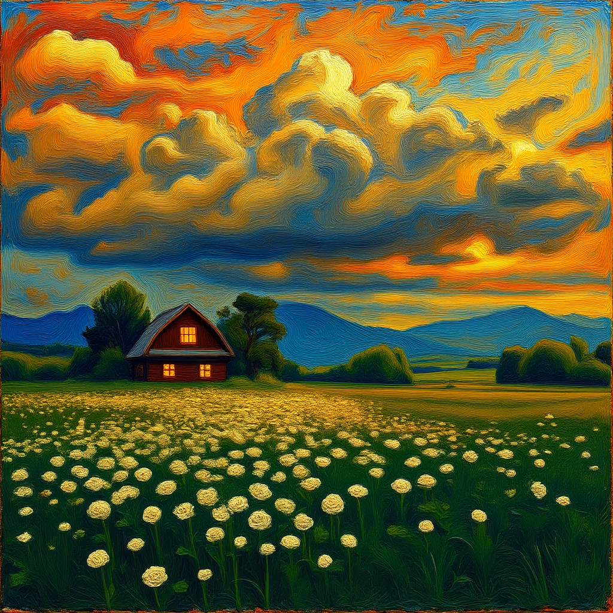

# Impasto Paintings with FLUX.1 Kontext [dev]

This project fine-tunes the **FLUX.1 Kontext [dev]** model to generate **impasto-style paintings** using a LoRA checkpoint.

---

## 🚀 Features
- Generates any image into impasto-style digital paintings with simple text prompt.
- Built on **FLUX.1 Kontext [dev]** model.
- Fine-tuned using **OstrisAI-Toolkit** on Hugging Face Spaces.

---

## 📚 Dataset

- **Name:** [Dataset](https://huggingface.co/datasets/nharshavardhana/my_first_lora_v3-dataset)
- **Description:** Curated specifically for high-fidelity texture synthesis in impasto-style paintings. Includes annotated brushstroke patterns, layered pigment simulations, and style-consistent image pairs optimized for LoRA finetuning.

---

## 🧠 Model & Weights

- **Base Model:** [FLUX.1 Kontext [dev]](https://huggingface.co/black-forest-labs/FLUX.1-Kontext-dev)  
- **LoRA Weights:** [Impasto Painting Kontext LoRA](https://huggingface.co/nharshavardhana/impasto_painting_kontext_newest_version-lora)

---

## ⚙️ Training Details

- **Framework:** [OstrisAI Toolkit](https://huggingface.co/spaces/multimodalart/ai-toolkit) on Hugging Face Spaces 
- **Checkpoint:** Every 250 steps
- **Epochs:** Finetuned until 1500 steps for best texture fidelity
- **Learning rate:** 0.000005
---

## 📺 Demo Video

🎥 [Watch the Demo on YouTube](https://youtu.be/9Ve0sQLfY5Y?si=2szmsPEUZiYumDp-)

---

## 🖼️ Sample outputs

| Portrait | Dog | Countryside |
|-------------|---------------|----------------|
|  |  |  |

---
